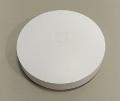

# BankEx IoT Mi Home to DeviceHive Adapter

## Overview

This repository contains Node.JS version of adapter for connecting Xiaomi Mi Home device family of various smart-home beacons to the DeviceHive platform for usage in smart-asset contracts of BankEx Proof-of-Asset protocol.

Currently supported devices:

### Mi controller (Wi-Fi)


Mandatory component

### Switch (ZigBee)



#### Events
* click
* double_click
* long_click_press

### Magnetic Sensor (ZigBee)


#### Events
* open
* close

### Motion Sensor (ZigBee)


#### Events
* motion

## Prerequisites

* Node.JS + NPM
* DeviceHive configuration parameters obtained upon user/device registration in DeviceHive admin panel:

Copy pre-defined device-hive-example.js config to local git-untracked file

```bash
cp devicehive-config-example.js dvicehive-config.js
```

and update params according to your credentials

* __server__ - server name where device hive API is running
* __login__ - login of end user
* __password__ - password of end user
* __deviceId__ - device identifier assigned by DeviceHive during device registration process. All Mi sensors are treated as sub-devices and all particular events will be present for this parent device id.

## Running

### Using Node.JS

```bash
npm install
npm start
```

```bash
Starting...
UDP Client listening on 0.0.0.0:9898
Listening for device events...
Event received: switch 11339 double_click
Event received: magnet 61119 close
Event received: magnet 61119 open
Event received: motion 2311 motion
```

All this data will be transferred in real-time to DeviceHive and further be stored on blockchain if using for Proof-of-Asset protocol

## References

1. Lightweight client for Mi protocol is based on Python example https://notes.jmsinfor.com/blog/post/admin/Xiaomi-Hub